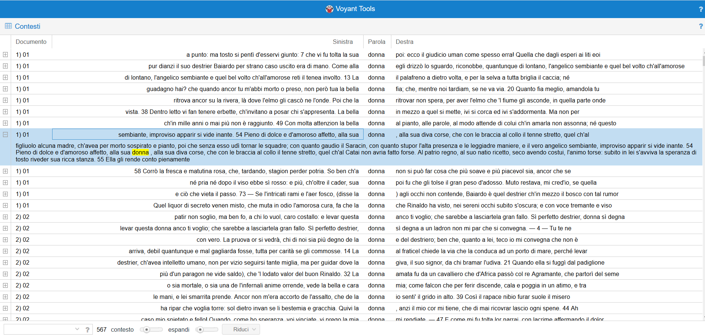
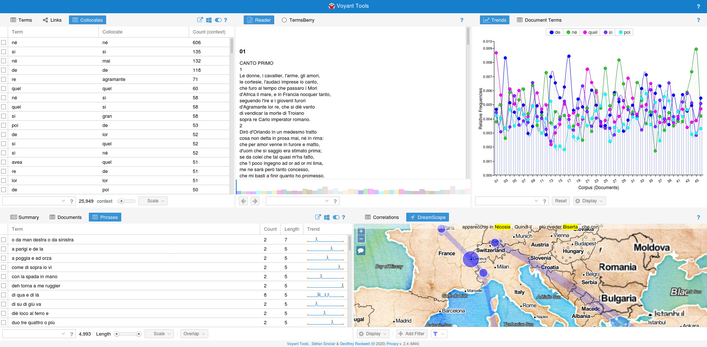

# Leggere i testi letterari con strumenti computazionali: alcuni consigli per facilitare lo studio e migliorare la comprensione

## Introduzione: dalla lettura "*tradizionale*" alla lettura "*a distanza*"
Alla base del **Distant Reading** c’è l’idea (provocatoria) di *studiare la letteratura senza leggere libri*. L’approccio quantitativo proposto da Moretti (e realizzabile attraverso Voyant) si basa sull’analisi di aspetti (frequenza delle parole, rappresentazioni grafiche delle relazioni tra personaggi, etc…) che solo una visione digitale d’insieme può fornire. Questi elementi, strutturati in reti e grafi, permettono di scoprire dettagli non altrimenti identificabili attraverso una lettura "*tradizionale*". Lo <a href="https://litlab.stanford.edu/" target="_blank">Stanford Literary Lab</a> prosegue il lavoro sulla teoria e la metodologia del *distant reading* anche attraverso la pubblicazione di brevi <a href="https://litlab.stanford.edu/pamphlets/" target="_blank">*pamphlet*</a> che raccontano - in maniera divulgativa - i risultati delle ricerche condotte. Una breve descrizione (in Inglese) dell’approccio *Distant Reading* è stata pubblicata dal <a href="https://www.nytimes.com/2011/06/26/books/review/the-mechanic-muse-what-is-distant-reading.html" target="_blank">New York Times</a>; un articolo di approfondimento è invece <a href="http://www.digitalhumanities.org/dhq/vol/11/2/000317/000317.html" target="_blank">disponibile a questo link</a>.

## La lettura "*a distanza*" in classe
Quali strategie sono efficaci per facilitare la lettura e la comprensione delle opere letterarie a scuola? Affiancando e supportando la lettura tradizionale dei testi (**Close Reading**), la lettura a distanza (**Distant Reading**) permette allo studente di allargare il proprio campo di indagine, aiutandolo a ricercare collegamenti e interconnessioni tra opere letterarie prodotte in un dato contesto storico e sociale, ma anche tra opere appartenenti ad autori e a correnti letterarie diverse. Il **Distant Reading** si rivela così uno strumento efficace nelle fasi di rielaborazione e ripasso dei contenuti affrontati e studiati in classe sotto la guida del docente.

### Lettura "a distanza" con GSuite
Vi proponiamo un’attività di annotazione sui personaggi dell’Orlando Furioso da svolgere su un documento Google. Vi invitiamo a copiare i nostri template direttamente nelle vostre cartelle di lavoro in modo da averli disponibili per far lavorare i vostri studenti individualmente o in modalità collaborativa. E se poi volete lavorare su altri testi letterari, potete semplicemente copiare le istruzioni e riproporre la stessa analisi su, ad esempio, I Promessi Sposi.

Qui trovate 3 template con le istruzioni e i testi già pronti per svolgere l’attività. Potete utilizzarli dopo averne fatto una copia nella vostra cartella di lavoro. 
* <a href="https://docs.google.com/document/d/1eDBRHC8bn77l17FybXi24rEb9Oj6_yeKC99IxfJsHOQ/edit" target="_blank">Canto I</a>

* <a href="https://docs.google.com/document/d/1pbQFT2vCh70Gp0bZtdM-pdMRMPIR7Z8uZnWdHtmkr1M/edit?usp=sharing" target="_blank">Canto XII</a>
* <a href="https://docs.google.com/document/d/1b5efKblb1NU-H620-V5NrtYgHHdjdDXQk0aCRV2sIYk/edit?usp=sharing" target="_blank">Canto XXIII</a>

### Lettura "a distanza" con Voyant

Abbiamo precaricato il testo completo di *Orlando Furioso* su Voyant; puoi accedere al progetto tramite <a href="https://voyant-tools.org/?panels=corpuscollocates,reader,trends,phrases,dreamscape&corpus=fbea33ff7b5ab2276593fcd3d9fc2ec1" target="_blank">questo link</a>

Qui trovate la guida di Voyant

Oggi vedremo insieme alcuni esempi di attività per prendere confidenza con lo strumento

## Esempio 1: le emozioni dell’opera
Quali sono le emozioni più significative nel poema? Quali nei canti specifici? A quali personaggi si riferiscono? 
Noi abbiamo fatto una prova con "amore".
Nel grafico degli  <a href= "https://voyant-tools.org/?corpus=fbea33ff7b5ab2276593fcd3d9fc2ec1&view=Trends&query=amor*&query=paur*&query=furor*" target="_blank">andamenti di "furor*", "amor*", "pazz*"</a> notiamo un’alta frequenza relativa di "amor*" nei canti 5, 13, 36. Perchè? Andiamo a vedere in <a href="https://voyant-tools.org/?corpus=fbea33ff7b5ab2276593fcd3d9fc2ec1&view=Contexts&query=amor*" target="_blank">Contesti</a> le specifiche occorrenze della parola nei vari canti, che potremo consultare integralmente nel <a href="https://voyant-tools.org/?corpus=fbea33ff7b5ab2276593fcd3d9fc2ec1&view=Reader" target="_blank">Lettore</a>. Scopriremo che nel canto 5 si parla d’amore per il racconto di Dalinda (Crudele Amore, mio amator, amoroso gioco, amava poco, ardea per tutto il cor, immensa fiamma...), mentre nel 36 per l’incontro tra Ruggiero, Marfisa e Bradamante in cui emergono i loro sentimenti (l’innamorato giovine, ch’ama amendue, l’un fiamma e furore, l’altro benivolenza piú ch’amore, amorosa lancia, avea nel cor fissa Bradamante…). Si parla però di amori molto diversi, come ci raccontano le ottave! 

## Esempio 2: il tema della pazzia 
La frequenza delle parole legate alla pazzia di Orlando ci dice qualcosa sulla centralità del tema nell’opera?
Osserviamo dal grafico degli <a href="https://voyant-tools.org/?corpus=fbea33ff7b5ab2276593fcd3d9fc2ec1&view=Trends&query=senno&query=pazz*&query=folle&query=furor*" target="_blank">andamenti</a> di furor*, pazz*, senno che nel canto 29 c’è una altissima frequenza di "pazz*", ma non solo: è anche l’unico caso in cui la follia è caratterizzata dal furore. Ma la follia di chi? Che cosa accade nel canto? Ariosto dice (29,50): "Pazzia sará, se le pazzie d’Orlando prometto raccontarvi ad una ad una; che tante e tante fur, ch’io non so quando finir". Nel resto del canto troviamo altri riferimenti alla follia di Orlando: O degli uomini inferma e instabil mente!, il pazzo orlando, il furioso conte, de la follia che cosí nudo il mena, Orlando in cui non cessa l’impeto e la rabbia…
E adesso sorge un’altra domanda: come sarà la follia nel resto dell’opera? Proviamo a scoprirlo con lo stesso approccio

## Esempio 3: la figura della donna: l’esempio di Bradamante
Come sono caratterizzate le figure femminili dell’opera? Ti sembra che ce ne sia qualcuna che non rispetta i canoni tradizionali dell’epoca? 
Nella visualizzazione che ci mostra i <a href= "https://voyant-tools.org/?corpus=fbea33ff7b5ab2276593fcd3d9fc2ec1&query=donn*&context=15&panels=corpuscollocates,reader,trends,phrases,dreamscape&view=Contexts" target="_blank">Contesti della parola donn*</a> scopriamo che alcune delle parole che ricorrono più frequentemente in associazione a "donna" appartengono alla sfera semantica dell’amore (*dolce*, *amoroso affetto*, *amorosa cura*, *ardore*) e della bellezza (*bella*, *angelico sembiante*, *bel volto*). Riesci a trovarne altre, magari opposte a queste, o legate ad un personaggio femminile in particolare? Che cosa ci dicono queste caratteristiche linguistiche sul ruolo della donna nella letteratura cavalleresca? Prova a riflettere su altre correnti letterarie che hai studiato (es. la figura della *donna angelo* nel Dolce Stil Novo). 

## Spunti per altre attività in classe

Ma quali sono le cose interessanti da vedere con Voyant? Se non te ne fossero venute già in mente, ti proponiamo qui alcuni spunti per ulteriori attività su testi letterari da svolgere con Voyant. Tutte le attività si riferiscono ad opere letterarie in Italiano, ma Voyant funziona con testi in qualsiasi lingua!

| Argomento                                     | Domanda                                                                                                                                                                                                      | Parole chiave                                                                                                                                                                                                           |
|-----------------------------------------------|--------------------------------------------------------------------------------------------------------------------------------------------------------------------------------------------------------------|-------------------------------------------------------------------------------------------------------------------------------------------------------------------------------------------------------------------------|
| Personaggi                                    | Come si caratterizzano i personaggi? Emergono dal testo delle associazioni significative?                                                                                                                    | Orlando, Rinaldo, Angelica…                                                                                                                                                                                             |
| Stile della narrazione                        | Quali sono le espressioni registiche di Ariosto che evidenziano l’andamento a zig\-zag dei personaggi? \(Nota: molte delle espressioni sono già raccolte dalla funzione Sintagmi/Phrases\)                   | di su, di giu, una strada a questa a quella; seguitiamo; torniamo; lascio; torno \(queste 4 ultime sono quelle dove ariosto fa "da regista"\); anche: "l’un fugge, e l’altro caccia", sopra/sotto, Or l'uno or l'altro  |
| Temi                                          | La frequenza delle parole legate alla pazzia di Orlando ci dice qualcosa sulla centralità del tema nell’opera?                                                                                               | Furore, follia, male, pazz\*, senno, turba\*                                                                                                                                                                            |
| Episodi: il castello di Atlante \(canto XII\) | Qual è la sfera lessicale dell’episodio?                                                                                                                                                                     | par\* \(pare, parere\)/sembianz\*/segret\*, "apparenza" e "vanità"                                                                                                                                                      |
| Parole                                        | Quali significati ha parola "selva"? Chi si muove nella selva? Ci sono personaggi che non entrano nella selva?                                                                                               | Selva                                                                                                                                                                                                                   |
| Parole                                        | Come viene delineata la figura del pagano?                                                                                                                                                                   | pagan\*, saracin \(saraceno\)                                                                                                                                                                                           |
| Lessico                                       | Com’è caratterizzato il filone narrativo militare? Le armi sono derise, temute, etc…? trovare due parti del testo in cui stessa parola ha usi diversi/opposti                                                | guerra, arm\*, cavalier\*                                                                                                                                                                                               |
| Tema                                          | La ricerca di orlando alla fine si rivela inutile?                                                                                                                                                           | invan\*, vano, vani, desider\*                                                                                                                                                                                          |
| Luoghi                                        | Che rapporto c’è tra luoghi reali e luoghi magici? Ci sono dei luoghi simbolici?                                                                                                                             | parigi, castello \(africa, grotta, palazzo\.\.\.\)                                                                                                                                                                      |
| Personaggi                                    | Come sono caratterizzate le figure femminili dell’opera? Ti sembra che ce ne sia qualcuna che non rispetta i canoni tradizionali dell’epoca? \(Bradamante\)                                                  | Bradamante, guerriera? innamorata? donzell\*, donn\*                                                                                                                                                                    |
| Stile della narrazione                        | Nell’Orlando Furioso sembra che non esistano più barriere spazio\-temporali\. Riesci a trovare degli esempi?                                                                                                 | andar\*, muov\*, camin\*,                                                                                                                                                                                               |
| Stile della narrazione                        | Quali sono i suoni dell’Orlando Furioso?                                                                                                                                                                     | sentir\*, rumor\*,                                                                                                                                                                                                      |
| Lessico                                       | Quante volte compare il termine "labirinto" nell’Orlando Furioso? In quali passi? \(compare tre volte\)                                                                                                      | labirint\*                                                                                                                                                                                                              |
| Temi                                          | Quali sono le emozioni più significative nel poema? E nei canti specifici?                                                                                                                                   | amor\*, furor\*, rabb\*, paur\*\.\.\.                                                                                                                                                                                   |
| Temi                                          | Come si configura il sentimento dell’amore nell’opera?                                                                                                                                                       | \[amore vano di Orlando per Angelica\] \[amore a lieto fine di Ruggero e Bradamante\]                                                                                                                                   |
| Collegamenti                                  | Come viene rappresentata la figura di Bradamante ne "L’Orlando Innamorato" di Boiardo e ne "Le città invisibili" di Calvino? Ti sembra ci siano delle differenze o dei punti in comune tra queste tre opere? | Bradamante                                                                                                                                                                                                              |
| Riferimenti intertestuali                     | Possiamo fare dei parallelismi tra la pazzia di Orlando e quella di Ercole nell’Hercules Furens senecano?                                                                                                    | furore\.\.\.                                                                                                                                                                                                            |

## Primi passi con Voyant
In questa sezione trovate alcuni consigli per muovere i primi passi con Voyant: dall’utilizzo dei singoli strumenti, alla creazione di un dataset personalizzato.
Iniziamo con una breve panoramica dei 5 strumenti che abbiamo scelto per usare la *distant reading* su testi di letteratura: cliccando su <a href="https://voyant-tools.org/?panels=corpuscollocates,reader,trends,phrases,dreamscape&corpus=fbea33ff7b5ab2276593fcd3d9fc2ec1" target="_blank">questo link</a>
 si aprirà il dataset contenente tutta l’opera Orlando Furioso. L’interfaccia si presenterà come raffigurato nell’immagine qui sotto:

I 5 strumenti precaricati sono solo una piccola parte di quelli che Voyant mette a disposizione! Abbiamo selezionato quelli più utili per svolgere le attività proposte, ma in ogni momento puoi provare ad usare altre funzionalità. Qualsiasi modifica che farai all’interfaccia **è temporanea, e visibile solo dall’utente che la sta utilizzando**, quindi nessun timore: sperimenta funzioni diverse e scopri quali altre potrebbero esserti utili. Per ogni strumento e per l’interfaccia complessiva (la barra blu in cima alla pagina) sono disponibili 4 pulsanti: :

- : permette di creare un link diretto allo strumento (o all’interfaccia) selezionata, completa dei risultati prodotti.
- : attraverso questo pulsante puoi selezionare uno strumento diverso tra quelli che Voyant offre.
- : questo pulsante permette di accedere alle opzioni dello strumento attivo.
- : accedi alla guida dello strumento attivo.

La <a href="https://voyant-tools.org/docs/" target="_blank">guida online di Voyant</a> contiene una dettagliata descrizione di tutti gli strumenti, oltre alle istruzioni su come usare la piattaforma per creare dataset personalizzati. 

Le funzioni che abbiamo scelto - ed esemplificato nell’immagine sopra - sono:

1. **Collocates/Collocati**: parole che co-occorrono, che si trovano insieme più frequentemente, dato un certo contesto
2. **Reader/Lettore**: permette di consultare i testi presenti nel corpus, graficamente rappresentati con barre. Cliccando su una parola vengono fornite informazioni sulla frequenza e la loro distribuzione all’interno del testo.
3. **Trends/Andamenti**: presenta un grafico dell’andamento della frequenza relativa delle parole nel documento, o della parola/e selezionate negli altri strumenti. Il grafico si aggiorna "live".
4. **Phrases/Sintagmi**: mostra le combinazioni *fisse*/ di parole più frequenti nel testo/i.
5. **Dreamscape**: è una funzione sperimentale (che produce risultati spesso imprecisi) che estrae i nomi di luoghi presenti nel testo, e li visualizza su una mappa geografica, creando automaticamente un "viaggio" tra i diversi luoghi basato sull’ordine di apparizione dei luoghi nel testo.

 ## Dove trovare opere complete da caricare su Voyant
Ecco un breve elenco di siti (legali!) dai quali scaricare opere complete in formato di testo semplice (`.txt`) da usare con Voyant.

- <a href="https://www.gutenberg.org/" rel="" target="_blank">Project Gutenberg</a>
- <a href="https://it.wikisource.org/wiki/Pagina_principale" rel="" target="_blank">WikiSource</a>
- <a href="https://www.liberliber.it/online/" rel="" target="_blank">LiberLiber</a>
